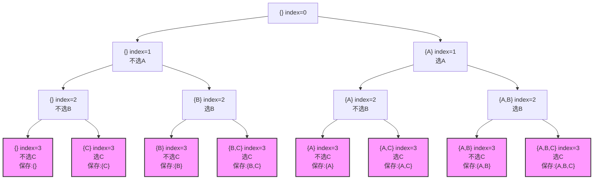

**题目：**
生成`n`个元素的所有子集，有`2n`个
例如：`E={a,b,c}`的子集有
```txt
{} {a} {b} {c} {a,b} {a,c} {b,c} {a,b,c}
000,100,010,001,110,101,011,111
```
思想：生成对应与元素出现位置的数组，0 表示该元素不出现，1 表示该元素出现

用递归实现思路：
对于一个空列表，每次有两种选择：存放元素 和 不存放元素，对于选择了这两个状态之一形成的一个新列表，又有这两种选择，从而形成递归树。

比如我们以输入集合 `{"A", "B", "C"}` 为例。



递归树的关键特点：

1. **树的结构**:
   - 每个节点表示递归的一个状态
   - 节点内包含：当前子集内容、当前处理的索引位置(`index`)
   - 粉色节点表示叶子节点，即达到基线条件(`index=3`)的状态

2. **分支过程**:
   - 每个非叶子节点都有两个分支：
     - 左分支：不选择当前元素
     - 右分支：选择当前元素

3. **递归层次**:
   - 第一层(index=0)：决定是否选择"A"
   - 第二层(index=1)：决定是否选择"B"
   - 第三层(index=2)：决定是否选择"C"
   - 第四层(index=3)：达到基线条件，保存子集

4. **决策路径示例**:
   从根节点到叶子节点的每条路径代表一个完整的决策序列，例如：
   ```
   {} -> {} -> {} -> {}     // 一个都不选
   {} -> {} -> {C} -> {C}   // 只选C
   {} -> {B} -> {B} -> {B}  // 只选B
   等等...
   ```

5. **回溯过程**:
   - 在访问完右子树后，需要将最近添加的元素删除
   - 例如：在处理完 {A,B,C} 后，需要回溯到 {A,B}，然后继续处理其他分支

6. **状态变化**:
   - 每向下一层，index 增加1
   - 每添加一个元素，currentSubset 增加一个元素
   - 每回溯一次，删除最后添加的元素

7. **递归终止**:
   - 当 index 等于集合大小(3)时达到叶子节点
   - 此时将当前构建的子集加入到结果集中

这个递归树清晰地展示了算法的完整执行过程，每条从根到叶的路径最终都会生成一个唯一的子集。通过这个树，我们可以看到：
- 总共有 8 个叶子节点，对应 2³ 个子集
- 树的深度是 4 (0到3)，对应集合大小加1
- 每个内部节点都做出一个二元决策（选或不选）