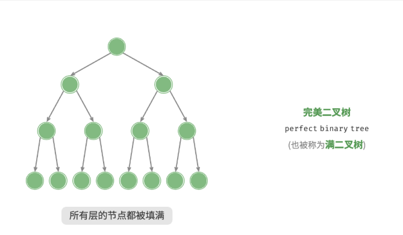
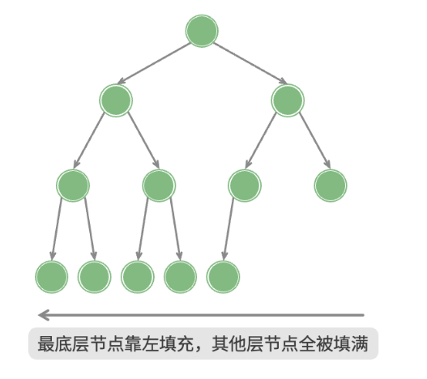
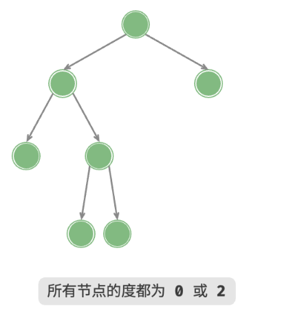
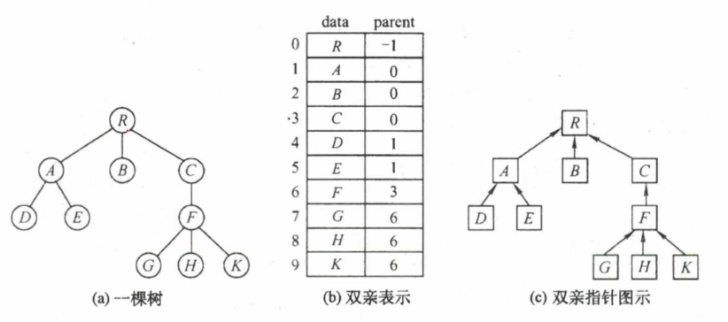
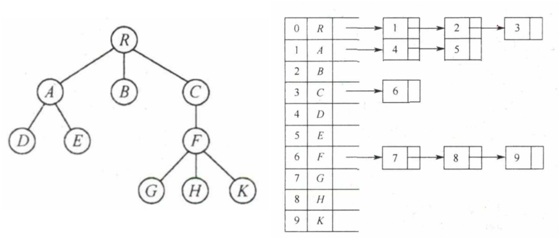
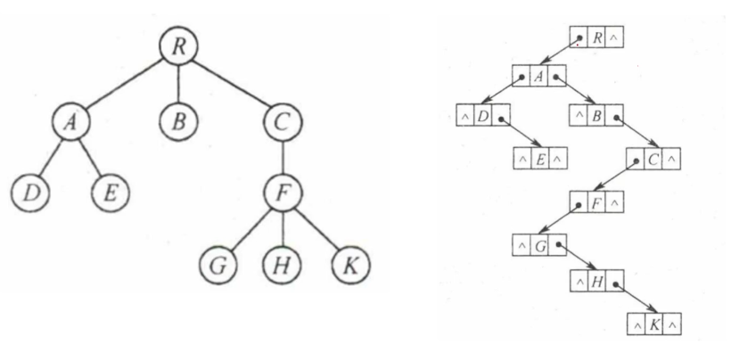
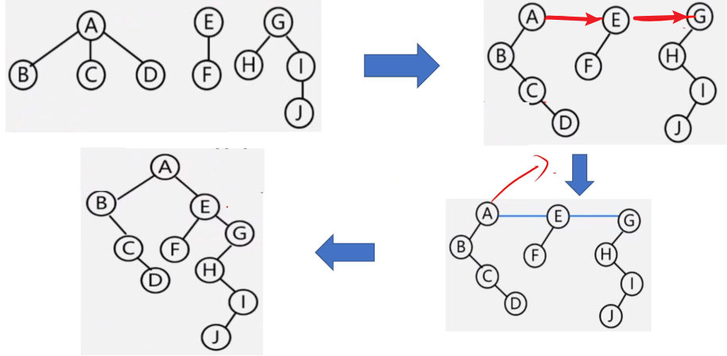

# 1.基本概念

1. **根节点\((root\ node)\)：** 位于二叉树顶层的节点，没有父节点。
2. **叶节点\((leaf\ node)\)：** 没有子节点（度为0）的节点，其两个指针均指向`None`。
3. **边\((edge)\)：** 连接两个节点的线段，即节点引用（指针）。
4. **节点所在的层\((level)\)：** 从顶至底递增，根节点所在层为`1`。
5. **节点的度\(（degree)\)：** 节点的子节点的数量。比如在二叉树中，度的取值范围是`0、1、2`。
6. **二叉树的高度\((height)\)：** 从 **根节点** 开始到 **最远叶节点** 结束，所经过的节点的数量。
7. **节点的深度\((depth)\)：** 从 **根节点** 开始到 **该节点** 结束所经过的节点的数量。
8. **分支节点：** 又称非叶子（终端）节点，指除叶节点之外的其他节点。

---

9. 二叉树图例
    - **满二叉树** （完美二叉树）
      

    - **完全二叉树**
      

    - **完满二叉树** （最优二叉树）
      


---

# 2.知识点

---

## 2.1 哈夫曼编码

哈夫曼编码（Huffman Coding）是一种基于 **贪心算法** 的最优前缀编码方法，用于无损数据压缩。其核心思想是 **为高频字符分配短编码，低频字符分配长编码** ，从而最小化整体编码长度。

---

### 2.1.1 编码规则

1. **统计频率**  
   统计所有待编码字符的频率（或权重）。

2. **构建优先队列**  
   将每个字符及其频率视为一个节点，按频率从小到大排列成一个优先队列。

3. **构建哈夫曼树**  
   重复以下操作，直到队列中只剩一个根节点：  
   - 取出队列中频率最小的两个节点。  
   - 创建一个新节点，其频率为这两个节点频率之和，并将它们作为左右子节点。  
   - 将新节点重新插入队列中。

4. **分配编码**  
   从根节点出发，向左子树路径标记为`0`，向右子树路径标记为`1`。叶节点（字符）的路径即为它的哈夫曼编码。

---

### 2.1.2 示例说明

假设需要压缩的字符集为 `{A, B, C, D}`，各个字符出现的频次分别为 `{5, 3, 2, 1}`。

**步骤1：统计频次**
| 字符 | 频次 |
| ---- | ---- |
| A    | 5    |
| B    | 3    |
| C    | 2    |
| D    | 1    |

**步骤2：构建初始优先队列**
将所有字符按频率从小到大排列为队列：`D(1) → C(2) → B(3) → A(5)`

**步骤3：构建哈夫曼树**
1. **第一次合并**  
   取出最小的两个节点 `D(1)` 和 `C(2)`，合并为新节点 `3`，插入队列：  
   ```bash
       3(新节点)
      /   \
    D(1) C(2)
   ```  
   新队列：`B(3) → 3(合并后的节点) → A(5)`

2. **第二次合并**  
   取出最小的两个节点 `B(3)` 和 `3`，合并为新节点 `6`：  
   ```bash
       6(新节点)
      /   \
    B(3)  3
          / \
        D(1) C(2)
   ```  
   新队列：`A(5) → 6(合并后的节点)`

3. **第三次合并**  
   取出最后两个节点 `A(5)` 和 `6`，合并为根节点 `11`：  
   ```bash
         11(根节点)
        /    \
      A(5)   6
             / \
           B(3) 3
               / \
             D(1) C(2)
   ```

**注意：** 每合并一次，都要 **把合并后的值送进队列** ，再重新选择队列中最小的两个值进行合并。比如上面的示例中：初始队列为`{1, 2, 3, 5}`，第一次合并后队列变为`{3, 3(1, 2 合并后的), 5}`。


**步骤4：分配编码**
从根节点到每个叶节点的路径即为编码（向左都为`0`，向右都为`1`）：  
- **A** ：路径为 左 = `0`  
- **B** ：路径为 右→左 = `10`  
- **C** ：路径为 右→右→右 = `111`  
- **D** ：路径为 右→右→左 = `110`

最终编码表：  
| 字符 | 编码 |
| ---- | ---- |
| A    | 0    |
| B    | 10   |
| C    | 111  |
| D    | 110  |

---

### 2.1.3 关键特性

1. **前缀编码**  
   任何字符的编码都不是另一个字符编码的前缀，保证解码无歧义。例如，`A=0`，`B=10`，不会出现以`0`开头的其他编码。

2. **最优性**  
   哈夫曼编码是 **带权路径长度最短** 的二叉树，压缩效率最高。

3. **动态分配**  
   编码长度与字符频率成反比，高频字符用短编码，低频用长编码。

---

## 2.2 树、二叉树、森林的转换

---

### 2.2.1 树的存储方式

1. 双亲表示法


2. 孩子表示法


3. 孩子兄弟表示法（二叉链表表示）： **左孩子、右兄弟**


---

### 2.2.2 转换

1. 树转二叉树和二叉树转树就按照 **左孩子、右兄弟** 的方式来做。

2. 森林转二叉树也按照 **左孩子、右兄弟** 的方式来做。先把各个树转化成二叉树，然后 **向右连线** 。


树转森林的话，就沿着 **右边** 简短线就行，比如这里就把`A-E`和`E-G`剪断。

---

## 2.3 遍历

---

### 2.3.1 二叉树的遍历

常见问题是 **已知先（后）序遍历与中序遍历，求后（先）序遍历** 。

只需要抓住二叉树遍历的核心： **先序遍历的第一个节点一定是根节点，后序遍历的最后一个节点一定是根节点** 。找到根节点后，把这个根节点带入到中序遍历中，就能依据这个根节点判断出左右子树，最后递归求解就行。

比如有中序遍历序列为`{D, E, B, A, C}`，假如我们已经通过先序或者后序遍历确定了根节点是`A`，那么我们可以这样看中序遍历：
```bash
D E B | A | C
```
`D E B`就是左子树，`C`就是右子树，是不是就该悟了？

放个这张图在这儿，看下能不能理解，理解了的话，能解锁更简单的方法哦😋。
|        |        |        |        |
| ------ | ------ | ------ | ------ |
| **根** |        | 根     |        |
| **左** | 左     |        |        |
| **右** |        |        | 右     |
|        | **左** | **根** | **右** |

---

### 2.3.2 树和森林的遍历

推荐阅读：[[数据结构] 树、森林的遍历 ](https://www.cnblogs.com/MarisaMagic/p/17091971.html)。注意：这篇文章中说的森林转换为二叉树的中序遍历，正好对应了森林中序遍历的结论是错误的！！

需要知道的结论：
1. 树的 **先根遍历** 对应其转换成的二叉树的 **前序遍历** ；树的 **后根遍历** 对应其转换成的二叉树的 **中序遍历** 。
2. 森林的 **先根遍历** 对应其转换成的二叉树的 **前序遍历** ；森林的 **后根遍历** 对应其转换成的二叉树的 **中序遍历** 。

---

## 2.4 线索二叉树

定义：
1. 若节点有左子树，则`l_child`指向其左孩子；否则`l_child`指向其直接前驱（即线索）；
2. 若节点有左子树，则`r_child`指向其右孩子；否则`r_child`指向其直接后继（即线索）。

注：前驱和后继是指某种遍历顺序（如前序、中序、后序）中的前驱节点或后继节点。

为区分`l_child`，`r_child`，设置两个标志域，`l_tag`，`r_tag`
`l_tag = 0`, `l_child`指向左孩子；
`l_tag = 1`, `l_child`指向其前驱；
`r_tag = 0`, `r_child`指向右孩子；
`r_tag = 1`, `r_child`指向其后继。

**在含有\(N\)个节点的线索二叉树中，线索的数目为\(N+1\)。**

证明：
**指针总数** ：每个节点有 2 个指针（左指针和右指针），总共有 \( 2N \) 个指针。
**非空指针（边）数目** ：普通二叉树中，边的数量为 \( N - 1 \)（一条边对应一个指针）。
**空指针数目** ：总空指针数 = 总指针数 - 非空指针数  
\[2N - (N - 1) = N + 1\]

---

# 3. 常用结论

1. 对任意一颗树，设其总节点树数为`n`，边数为`e`，那么有：\( e = n-1 \)。

---

2. 对任意一颗树，总边数等于所有节点的度数之和。

---

3. 任意一颗非空 **二叉树** ，叶节点（度为`0`的节点）数比度为`2`的节点数多`1`。

`结论3`证明过程如下：

- **定义符号** ：
   - \( n_0 \)：叶节点数（度为0）。
   - \( n_1 \)：度为1的节点数。
   - \( n_2 \)：度为2的节点数。
   - 总节点数 \( n = n_0 + n_1 + n_2 \)。

- **边数与节点的关系** ：
   - 二叉树中边数 \( e = n - 1 \)（树的性质：边数 = 节点数 - 1）。
   - 边数也可由度数之和计算：每个度为2的节点贡献2条边，度为1的贡献1条边，叶节点不贡献。因此，边数 \( e = n_1 + 2n_2 \)。

- **联立方程** ：
   \[
   n_1 + 2n_2 = n - 1 \quad \text{（由边数相等）}
   \]
   代入总节点数 \( n = n_0 + n_1 + n_2 \)，得：
   \[
   n_1 + 2n_2 = (n_0 + n_1 + n_2) - 1
   \]
   化简后得到：
   \[
   n_0 = n_2 + 1
   \]
   **即叶节点数比度为2的节点数多1** 。

---

4. 哈夫曼树只有度为`0`和度为`2`的节点。哈夫曼树是完满二叉树（也称作 **最优二叉树** ），完满二叉树中，设叶节点为\(n\)，总节点为\(m\)，那么有\( 2n-1 = m \)。

---

5. 卡特兰数与二叉树：用于计算已知先序序列后，求所有不同二叉树的数目。无论给定何种先序序列，只要节点数为 \(n\)，不同的二叉树结构数目始终为 **第 \(n\) 个卡特兰数** 。

    对于 \(n\) 个节点构成的二叉树，其不同结构的数目由 **第 \(n\) 个卡特兰数** \(C(n)\) 给出，计算公式为：
\[
C(n) = \frac{1}{n+1} \binom{2n}{n} = \frac{1}{n+1} C_{2n}^n = \frac{1}{n+1} \cdot \frac{(2n)!}{n! \cdot (2n-n)!}
\]
    比如对于 \(n=4\)（即序列长度为4），卡特兰数 \(C(4) = 14\)，表示4个节点可以构成14种不同的二叉树。 **在考虑先序序列固定的情况下，结构数目由卡特兰数决定，而不需要考虑节点的排列组合，因为先序序列已经确定了节点的顺序。**

---

6. 森林中的每个 **叶节点** 在转换后的二叉树中必然 **左孩子为空** （因为转换是按照 **左孩子，右兄弟** 来的，叶子节点无孩子），而非叶节点的左孩子不为空。因此： **森林叶节点数 = 二叉树左孩子(指针)为空的节点数** 。

---

7. 除了构造哈夫曼二叉树，还能构造 **哈夫曼\(m\)叉树** 。为了构造严格的\(m\)叉树，若原始叶节点数不满足合并条件，要补充权为`0`的 **虚叶节点** 以确保每次能合并\(m\)个节点。

   设原始叶节点数为\( n \)，构造\( m \)叉树需满足：
\[
u = (n - 1) \mod (m - 1)
\]
   若\(u = 0\)，则不需要补充虚叶节点，否则需要补充\((m-u-1)\)个权为\(0\)的虚叶节点。

   - **虚叶节点作用** ：确保每次合并有足够节点，不影响实际权值节点的最优编码路径。
   - **最优性保证** ：合并时始终选择最小`m`个节点，遵循贪心策略，带权路径长度最短。

---

8. 树转二叉树中，若树\(m\)个节点，其叶节点有\(n\)个，那么该树对应的二叉树中无右孩子的节点个数为\(m-n+1\)。
   **原理：** 原树转换为二叉树后，没有右孩子的节点数目等于原树中<u>每个节点的最后一个子节点数目加上根节点</u>。因为<u>每个非叶子节点的最后一个子节点在转换后的二叉树中没有右孩子，且 **每个非叶节点至少有一个子节点** </u>，而根节点本身在转换后的二叉树中也没有右孩子（因为原树只有一个根，没有兄弟）。

---

# 4. 代码（练习）

---

## 4.1 判断二叉搜索树

这里判断由列表存储的二叉树是否为二叉搜索树，首先是递归实现：
```C++
bool recursion(vector<int> &tree, int index, int min_val, int max_val){
   if(index >= tree.size() || tree[index] == -1){
      return true;
   }

   int curr_node = tree[index];
   if(curr_node <= min_val || curr_node => max_val){
      return false;
   }

   // 左子树和右子树都满足 左 < 当前节点 < 右 ，则返回为 ture
   return recursion(tree, 2 * index + 1, min_val, curr_node) &&
          recursion(tree, 2 * index + 2, curr_node, max_val);
}

bool is_BSD(vector<int> &tree){
   if(tree.empty()){
      return true;
   }

   return recursion(tree, 0, INT_MIN, INT_MAX);
}
```

当然，这里也可以采用迭代实现，用栈来模拟递归操作：
```C++
struct NodeInfo(){
   int index;
   int min_val;
   int max_val;
};


bool iteration(vector<int> &tree){
   if(tree.empy()) return true;

   stack<NodeInfo> stk;
   stk.push({0, INT_MIN, INT_MAX});

   while(!stk.empty()){
      NodeInfo current = stk.top();
      stk.pop();

      int curr_index = current.index;
      int curr_min_val = current.min_val;
      int curr_max_val = current.max_val;

      // 跳过空节点
      if(curr_index >= tree.size() || tree[curr_index] == -1){
         continue;
      }

      if(tree[curr_index] <= min_val || tree[curr_index] >= max_val){
         return false;
      }

      stk.push({2 * index + 1, min_val, tree[curr_index]});
      stk.push({2 * index + 2, tree[curr_index], max_val});
   }

   return true;
}
```

---

## 4.2 求二叉树的 WPL

```C++
int get_WPL(TreeNode* root, int depth = 1) {
   if(root->left == nullptr && root->right == nullptr){
      return root * (depth - 1);
   }

   // 左边子树的带权路径 + 右边子树的带权路径
   return get_WPL(root->left, depth + 1) + get_WPL(root->right, depth + 1);
}
```
除了用递归的方式，还可以采用迭代的方式（`BFS`搜索），依次处理节点。

---

## 4.3 统计树的叶节点


---

## 4.4 获取家谱树信息


---

## 4.5 计算树的后代节点树和节点的右兄弟节点数