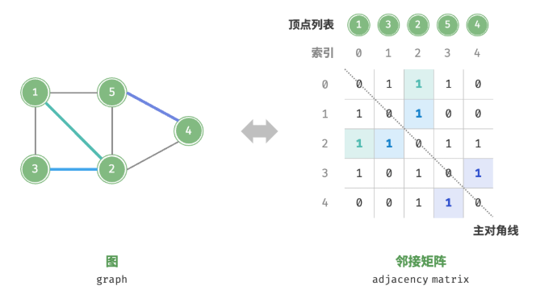
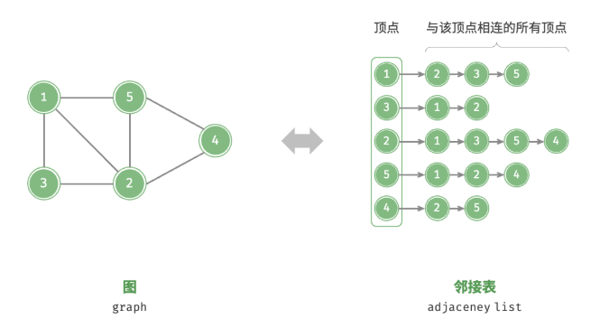
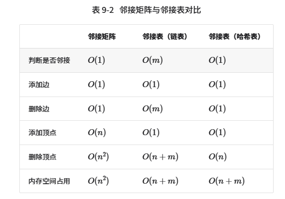
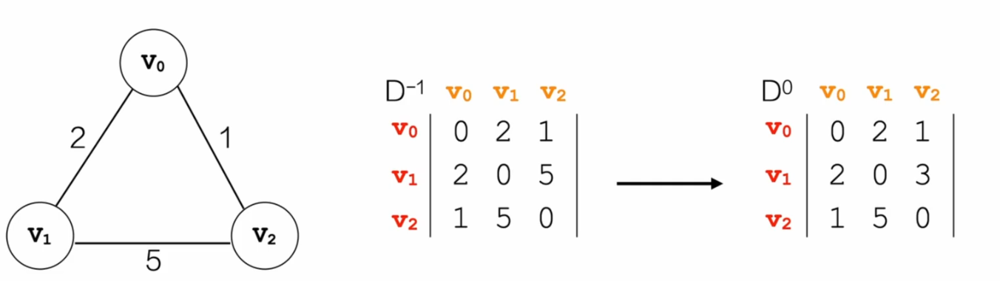
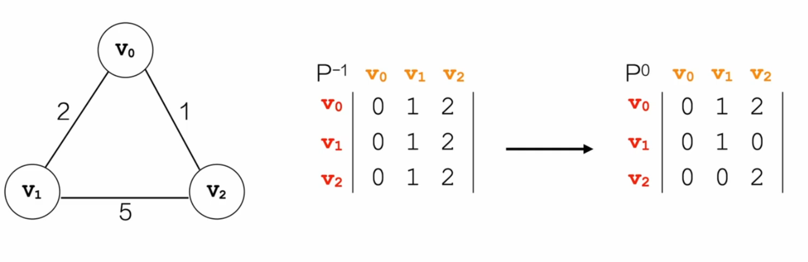
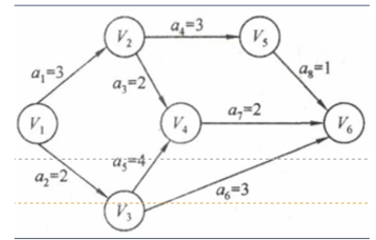
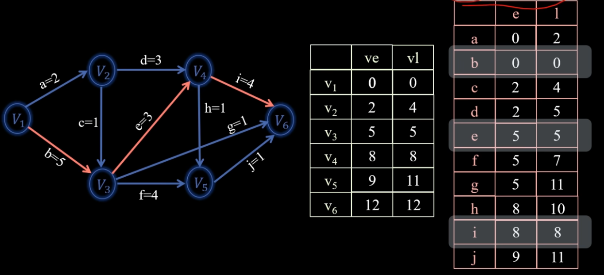
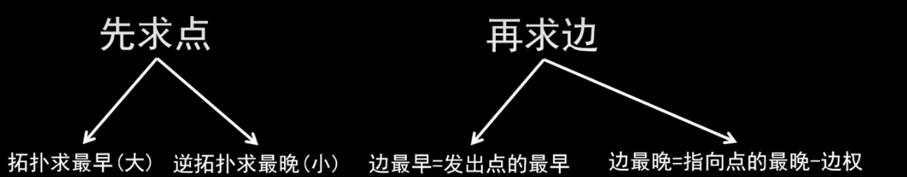
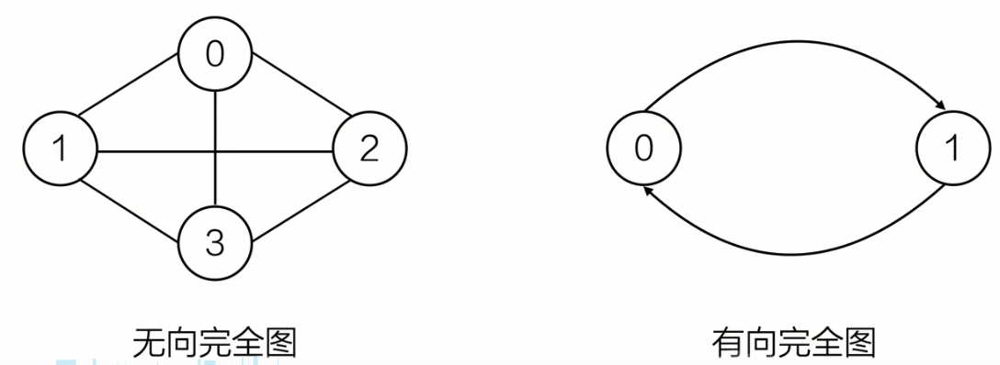
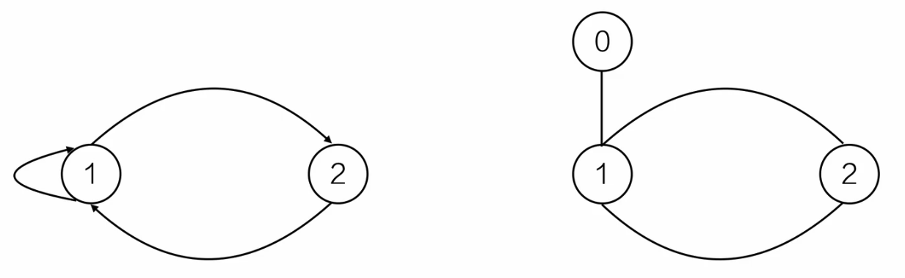

# 1.基础知识点

**注意：对于图这种数据结构，不允许没有顶点，但边集可以为空。**

## 1.1 图的存储结构

有三种方式：`邻接矩阵`，`邻接表（链表）`，`邻接表（哈希表）`





注意：在做题时，需要知道邻接表中`data`域存储的应该是连同顶点在数组中对应的 **索引** ，而不是像图示中连接的是顶点值。

设图中共有`n`个顶点和`m`条边，表 9-2 对比了邻接矩阵和邻接表的时间效率和空间效率。


观察表 9-2 ，似乎邻接表（哈希表）的时间效率与空间效率最优。但实际上，在邻接矩阵中操作边的效率更高，只需一次数组访问或赋值操作即可。综合来看，邻接矩阵体现了“以空间换时间”的原则，而邻接表体现了“以时间换空间”的原则。

---

## 1.2 最小生成树

---

### 1.2.1 Prim （普里姆）算法（加点法）

先确定一点，依次加点（每次选择连接两点最短的那条路径）。

---

### 1.2.2 Kruskal （克鲁斯卡尔）算法（加边法）

先确定一边，依次加边（每次选择能联通顶点的那条最短路径）

---

## 1.3 最短路径

---

### 1.3.1 Dijkstra （迪杰斯特拉）算法

Dijkstra 算法用于解决 **单源路径最短** 问题，该算法本质是 **贪心** 策略。

```C++
// 辅助函数：用于查找 distance 中最小的那个值，且对应的 visited 为 false
int chooose_index(vector<int> distance, vector<bool> visited, int size){
    int min_distance = INT_MAX;
    int min_position = -1;

    for(int i = 0; i < size; i++){
        if(distance[i] < min_distance && !visited[i]){
            min_distance = distance[i];
            min_position = i;
        }
    }

    return min_position;
}


/* 用数组实现 */
vector<int> dijkstra(int start, vector<vector<int>> adjMat) {
    int n = adjMat.size();

    // 下面三个数组的索引与 vertices 的索引相对应
    vector<int> distance(n, INT_MAX); // start （起点）到达每一个点的最短路径大小
     vector<bool> visited(n, false);   // 顶点是否已经访问过
    vector<int> path(n, -1);          // 路径：存放的是顶点的前驱顶点，倒着往回推出整个路径

    // 初始化起点
    for (int i = 0; i < n; i++) {
        distance[i] = adjMat[start][i];
    }

    visited[start] = true; // 在初始化 distance 的时候，vertices[0] 就访问过了
    distance[start] = 0;   // 可以不要，但是为了保证逻辑严密性，还是加上

    int next; // 接下来要访问的那个顶点
    // 这里初始化 i 为 1，因为在一开始（初始化 distance）的时候，就已经完成填写了从 第0个顶点 直接到其它顶点的最短路径
    for (int j = 1; j < n; j++) {
        next = choose_index(distance, visited, n);
        visited[next] = true;
        for (int k = 0; k < n; k++) {
            // 这里加上判断条件 adjMat[next][k] != INT_MAX 的原因是：num + INT_MAX 会溢出
            if (visited[k] == false && adjMat[next][k] != INT_MAX && distance[next] + adjMat[next][k] < distance[k]) {
            distance[k] = distance[next] + adjMat[next][k];
            path[k] = next;
            }
        }
    }

    // 优化下 path 数组输出
    for(int m = 1; m < n; m++){
        if(path[m] == -1){
            path[m] = start;
        }
    }

    return distance;
}
```

---

### 1.3.2 Floyd （弗洛伊德）算法

Floyd 算法用于解决 **所有点与点之间的最短路径** 问题，该算法本质是 **动态规划** 策略。



\(D\) 表示 \(distance\) 的意思，\(D^0\) 表示经过 \(V_0\) 中转到达下一个顶点，比如 \(D^0[V_1][V_2]\) 表示的就是 \(V_1\) 顶点经过 \(V_0\) 中转后，到达 \(V_2\)。自然，\(D^{-1}\) 表示的就是没有经过中转。也就是说在实现代码时，我们会维护一个 **二维的 \(distance\) 数组** ，用于存储顶点到其它顶点之间的权值（路径长度）。

这里定义：\(j\) 是起始顶点，\(k\) 是终止顶点，\(i\) 是中转顶点。

\[if \ \  D^{-1}[1][2] > D^{-1}[1][0] + D^{-1}[0][2]\]
\[so: \ \ D^0[1][2] = D^{-1}[1][0] + D^{-1}[0][2]\]
\[deduce: \ D^i[j][k] = D^{i-1}[j][i] + D^{i-1}[i][k]\]



\(P\) 表示 \(path\) 的意思，\(P^0\) 表示经过 \(V_0\) 中转到达下一个顶点，意思和 \(D\) 数组的含义类似。同样，我们也会维护一个 **二维的 \(path\) 数组** ，但是这个数组存储的值的含义就是 **终点的前驱顶点（\(P\) 的上标，中转节点）** 。比如 \(P^0\) 中，\(P[V_1][V_2] = 0\) 。 

\[if \ \  D^{-1}[1][2] > D^{-1}[1][0] + D^{-1}[0][2]\]
\[so： \ \ P^0[1][2] = P^{-1}[1][0]\]
\[deduce: \ P^i[j][k] = P^{i-1}[j][i]\]

```C++
vector<vector<int>> floyd(vector<vector<int>> adjMat){
    int n = adjMat.size();
    vector<vector<int>> distance(n, vector<int>(n, INT_MAX));   // distance 数组，存放距离
    vector<vector<int>> path(n, vector<int>(n, -1));            // path 数组，存放前驱顶点

    // 初始化 distance 数组和 path 数组
    // j: 起始顶点，k: 终止顶点
    for(int j = 0; j < n; j++){
        for(int k = 0; k< n; k++){
            distance[j][k] = adjMat[j][k];
            path[j][k] = k;
        }
    }

    // i: 中转顶点，j: 起始顶点，k: 终止顶点 （i, j, k 都表示顶点在 vertices 数组中的索引）
    // 第一层循环：索引从 [0, n - 1] 依次作为中转顶点
    for(int i = 0; i < n; i++){
    
        // 第二层和第三层循环构成二维数组，然后“填空”即可
        for(int j = 0; j < n; j++){
            for(int k = 0; k < n; k++){
                // 若 直达 > 中转，更新 distance 和 path ; distance[j][i] 和 distance[i][k] 都为 INT_MAX 的话，表示不可达
                if(distance[j][i] != INT_MAX && distance[i][k] != INT_MAX && distance[j][k] < distance[j][i] + distance[i][k]){
                    distance[j][k] = distance[j][i] + distance[i][k];
                    path[j][k] = path[j][i];
                }
            }
        }
    }

    return distance;
}
```


---

## 1.4 拓扑排序

用有图来描述一入工程或系统的进行过程。
一个工程可以分为若于个子工程，只要完成了这些子工程（活动），就可以导致整人工程的完成。
1. `AOV`网（`Activity On Vertices`）：用顶点表示活动的网络
2. `AOE`网（`Activity On Edges`）：用边表示活动的网络
**`AOV`网是顶点表示活动的网，它只描述了活动之间的约束关系，而`AOE`网是用有向边表示活动边上的权值表示活动持续的时间。**
`AOE`网是建立在`AOV`网基础之上（活动之间约束关系没有矛盾），再来分析完成整个工程至少需要多少时间，或者为缩短完成工程所需时间，应当加快那些活动等问题。

步骤：
1. 如果找得到任何一个入度为`0`的顶点`v`，则`step 2`，负责`step 4`;
2. 输出顶点`v`，并从图中删除该顶点以及与其相连的所有边；
3. 对改变后的图重复这一过程，转`step 1`；
4. 如果已经输出全部顶点，则结束；否则该有向图不是`DAG`（`Directed Acyclic Graph`，叫做有向无环图）。

## 1.5 关键路径

典型用途：“工程完成的最早时间是什么时候？”、“一个工程中哪些活动可以适当延迟，可以延迟多长时间，而不影响整个工期？”————非关键活动等。

- **`AOE`网：** 带权的有向无环图
- **顶点：** 事件或状态
- **弧（有向边）：** 活动及发生的先后关系
- **权：** 活动持续时间
- **起点：** 入度为`0`的点（只有一个）
- **终点：** 出度为`0`的点（只有一个）

如下图所示：


`AOE`网中 **没有入边** 的顶点称为 **始点** （或源点）， **没有出边** 的顶点称为 **终点** （或汇点）。其性质如下：
- 只有在某顶点所代表的事件发生后，从该顶点出发的各活动才能开始；
- 只有在进入某顶点的各活动都结束，该顶点所代表的事件才能发生。

**重要术语：**
- **关键路径：** 最耗时的那条路径。
- **关键活动：** 不能拖延的活动，**\(最早开始时间 = 最晚开始时间 = 0\)** 。活动其实就是指图的边，比如上图中 \(a_1\)，\(a_2\) 就是活动。
- **\(ve\):** **事件** 的最早开始事件。
- **\(vl\):** **事件** 的最晚开始时间。
- **\(e\):** **活动** 的最早开始时间。\(e = ve\)，\(ve\) 是发出点的。
- **\(l\):** **活动** 的最晚开始时间。\(l = vl - activity\)，\(V_l\) 是指向点的。
- **时间余量：** \(时间余量 = l - e\)



如上图所示，以活动`d`为例，它的 \(e\) 为 \(V_2\) 的 \(ve\)，即`2`；它的 \(l\) 为 \(V_4\) 的 \(vl\) 减去`d`的值，即`8-3=5`。

上图中的关键路径很显然就是`b`、`e`、`i`，当然，有时候关键路径可能有很多条。



---

# 2.常用结论

---

1. 无向图的度数与边数的关系：

    \[
    \sum_{v \in V} \deg(v) = 2E
    \]

    - \( \deg(v) \) 表示顶点 \( v \) 的度数（即与其相连的边的数量）。
    - \( E \) 表示图的 **边数** 。
    - 原因：因为每条边都会被两个端点计数一次。

对于有向图，所有顶点的出度与入度之和相等，弧（弧头和弧尾）的数量也相等。

---

2. 对于`AOE`网，若想缩短“工程工期”，如果该网有多条关键路径，需要 **所有关键路径上的活动时间同时减少，即选择缩短的活动必须涵盖在所有关键路径中** 。

---

3. 由于连通图中可能会存在权值相同的边，所以最小生成树是不唯一的，但是构造最小生成树的 **代价是唯一的** 。

----

4. 完全图（Complete Graph）：
   - 在 **无向图** 中，每一对不同的顶点之间都有一条**直接相连的边**。
   - 在 **有向图** 中，每一对不同的顶点之间都有**两个方向的边**（即双向连接）。



   - 一个 **无向完全图** 具有 \( n \) 个顶点，且每两个顶点之间都有一条边，边的总数为：
  \[
  E = \frac{n(n-1)}{2}
  \]
  这个公式来源于组合数 \( C_{n}^2 \)，即从 \( n \) 个点中任选 2 个点来形成一条边。
   - 一个 **有向完全图** 具有 \( n \) 个顶点，每两个顶点之间都有 **一对（2条）** 有向边，边的总数为：
  \[
  E = n(n-1)
  \]

---

5. \(连通分量 = 图中一个独立的“最大连通块”\)。若图本身是连通的，则整个图是唯一的连通分量；若图不连通，则被划分为多个连通分量。

---

6. 简单图与多重图：
   - 限制一：图中不能有从顶点到其自身的边；
   - 限制二：同一条边在图中不能出现两次或者两次以上。
   - 不满足以上两条限制的称为 **多重图** 。

    以上两个图都是多重图，注意：右边的图是无向图，所以`1-2`和`2-1`的性质一样，不满足限制二。

---

7. 在带权连通图中，当任意一个环中所包含的边的权值均不相同时，其 **MST（最小生成树）** 是唯一的。也可以这样说：权值必须唯一（即图中每条边的权重互不相同），或者MST 过程中不存在等权边的选择冲突。

---

1. 无权图 \(G\) 用邻接矩阵存储，把邻接矩阵设为 **\(A\)** ，若该图有 \(n(\ n>=2\ )\) 个顶点，则 **\(A^m \ (2<=m<=n)\)** 中第 \(i\) 行第 \(j\) 列的非零元素的含义是该图中顶点 \(i\) 到顶点 \(j\) 之间的长度为 \(m\) 的数量。这个结论适用于无向图和有向图，因为矩阵乘法的定义不依赖于边的方向。若图是带权图，数值表示所有路径的权重乘积之和（通常没意义）。