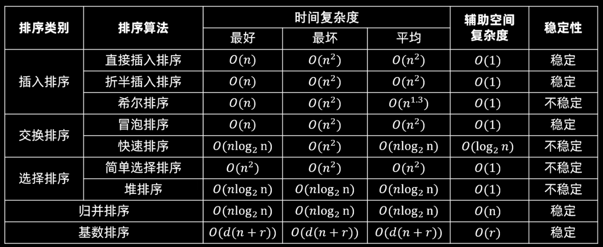

# 1.基本概念

各种排序方式对比：



---

# 2.排序算法代码实现

---

## 2.1 插入类排序

---

### 2.1.1 直接插入排序

```C++
void insert_sort_directly(vector<int> &nums){
    for(int i = 1; i < nums.size(); i++){
        int tmp = nums[i];
        // i 前面的元素都是排好序的，从 i 前面的元素开始
        int j = i - 1;
        // 移动比 tmp 大的元素
        while(j >= 0 && nums[j] > tmp){
            nums[j + 1] = nums[j];
            j--;
        }
        nums[j + 1] = tmp;
    }
}
```

---

### 2.1.2 折半插入排序

```C++
void insert_sort_binary(vector<int> &nums){
    for(int i = 1; i< nums.size(); i++){
         // 如果 nums[i] >= nums[i-1] ，直接去下一个数，因为前面的数都是有序的
        if(nums[i] >= nums[i - 1]){
            continue;
        }

        int tmp = nums[i];
        int right = i - 1;
        int left = 0;
        while(left <= right){
            int mid = left + (right - left) / 2;
            if(nums[mid] <= tmp){
                left = mid + 1;
            }else{
                right = mid - 1;
            }
        }

        int j = i;
        // 把从 left 开始的元素都往后移动，给 tmp 腾出空间
        while(j > left){
            nums[j] = nums[j - 1];
            j--;
        }

        // 插入 tmp，tmp 一定是插到 left 处
        nums[left] = tmp;
    }
}
```

---

### 2.1.3 希尔排序

```C++
void shell_sort(vector<int> &nums){
    // 定义增量
    int increment = nums.size() / 2;
    while(increment > 0){
        for(int k = 0; k < increment; k++){
            for(int i = k + increment; i < nums.size(); i+= increment){
                int tmp = nums[i];
                int j = i - increment;
                while(j >= 0 && nums[j] > tmp){
                    nums[j + increment] = nums[j];
                    j -= increment;
                }

                nums[j + increment] = tmp;
            }
        }

        increment /= 2;
    }
}
```

---

## 2.2 交换类排序

---

### 2.2.1 冒泡排序


---

### 2.2.2 快速排序


---

## 2.3 选择类排序

---

### 2.3.1 简单选择排序


---

### 2.3.2 堆排序


---

## 2.4 归并排序