# 1.知识点

---

## 1.1 查找表的分类和评价指标

**分类：**
- 静态查找表：仅作“查询”（检索）操作的查询表。
- 动态查找表：作：“插入”和“删除”操作的查询表。

**查找算法的评价指标：**
评价查找长度（ASL）：关键字的平均比较次数
\[
ASL = \sum_{i=1}^{n} p_i c_i
\]
\(n\): 记录的个数
\(p_i\): 查找第 \(i\) 个记录的概率（通常认为 \(p_i = 1 / n\)）
\(c_i\): 找到第 \(i\) 个记录所需的比较次数

比如有线性表：
```bash
1 2 3 4
```
那么 \(AVL = (1+2+3+4)/4 = 1/4 + 2/4 + 3/4 + 4/4\)，这里的 \(3/4\) 表示的就是找到第`3`个记录的概率。

---

## 1.2 线性表的查找

---

### 1.2.1 增加哨兵位减少比较次数

在 **线性表（如顺序表）** 中查找元素时，**添加哨兵位（Sentinel）** 是一种优化查找效率的技巧。哨兵位的作用是在查找过程中减少条件判断的次数，从而提高查找速度。

普通顺序查找（未使用哨兵）：
```C++
int sequentialSearch(int arr[], int n, int target) {
    for (int i = 0; i < n; i++) {
        if (arr[i] == target) {
            return i;  // 找到返回索引
        }
    }
    return -1;  // 查找失败
}
```
问题：每次循环都要判断 `i < n`，增加了开销。

使用哨兵优化：
```C++
int sequentialSearchWithSentinel(int arr[], int n, int target) {
    arr[n] = target;  // 在数组末尾添加哨兵
    int i = 0;
    while (arr[i] != target) {
        i++;  // 直接向后查找
    }
    return (i == n) ? -1 : i;  // 如果 i == n 说明查找失败
}
```
**优化点：**
- `while` 循环 **不需要检查边界**，因为 `arr[n]` 一定会匹配，保证查找终止。
- 仅在最后才检查 `i == n`，减少了循环中的额外判断。

---

### 1.2.1 二分查找（有序顺序表）

递归实现：
```C++
int binary_search_resursion(vector<int> nums, int target, int left, int right){
    int mid = left + (right - left) / 2;    // 避免溢出
    if(left > right){
        return -1;
    }

    if(nums[mid] == target){
        return mid;
    }
    if(nums[mid] < target){
        return binary_search_resursion(nums, target, mid + 1, right);
    }else{
        return binary_search_recursion(nums, target, left, mid - 1);
    }
}
```

迭代实现：
```C++
int binary_search_iteration(vector<int> nums, int target){
    int left = 0, right = nums.size() - 1;

    while(left <= right){
        int mid = left + (right - left) / 2;
        if(nums[mid] == target){
            return mid;
        }

        if(nums[mid] < target){
            left = mid + 1;
        }else{
            right = mid - 1;
        }
    }

    return -1;
}
```

补充：
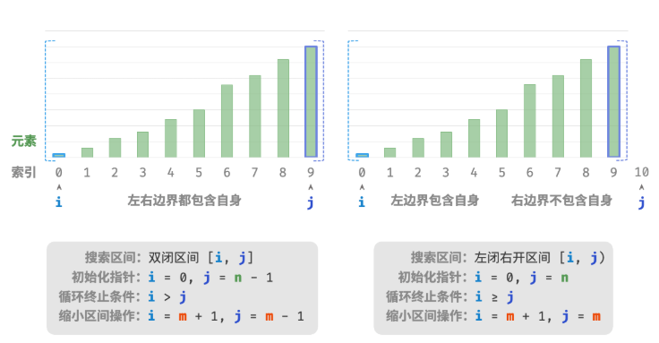

---

## 1.2 二叉搜索树

二叉搜索树也称作二叉排序树、二叉查找树。

查找操作：
```C++
bool is_existed(TreeNode *root, int target){
    if(!root){
        return false;
    }

    while(root){
        if(root->val == target){
            return true;
        }
        if(root->val < target){
            root = root-> right;
        }else{
            root = root -> left;
        }
    }

    return false;
}
```

插入操作：
```C++
void insert(TreeNode *root, int target){
    if(!root){
        root = new TreeNode(target);
        return
    }

    TreeNode *new_node = new TreeNode(target);
    // 需要定义前驱节点，记录前一个节点的信息
    TreeNode *prev = nullptr;
    // curr 节点为一直往左走或者右走，直到走到空
    TreeNode *curr = root;

    while(curr){
        // 找到重复节点，直接返回
        if(curr->val == target){
            return;
        }
        prev = curr;
        if(curr->val < target){
            curr = curr->right;
        }else{
            curr = curr->left;
        }
    }

    if(curr->val < target){
        curr->right = target;
    }else{
        curr->left = target;
    }
}
```

删除操作：
```C++
void remove(TreeNode *root, int target){
    if(!root){
        throw out_of_range("树为空！");
    }

    TreeNode *prev = nullptr;
    TreeNode *curr = root;
    // 循环查找，越过叶节点后跳出
    while(curr){
        // 找到待删除节点，跳出循环
        if(curr->val == target){
            break;
        }
        prev = curr;
        if(curr->val < target){
            curr = curr-> right;
        }else{
            curr = curr->left;
        }
    }

    // 若无待删除节点，则直接返回
    if(!curr){
        throw out_of_range("没有这个节点");
    }

    // 子节点数量 = 0 or 1
    if(curr->left == nullptr || curr->right == nullptr){
        // 当子节点数量 = 0 / 1 时， child = nullptr / 该子节点
        TreeNode *child = curr->left == nullptr ? curr->left : curr->right;
        // 删除节点 cur
        if(curr != root){
            if(prev->left == curr){
                prev->left = child;
            }else{
                prev->right = child;
            }
        }
        // 若删除节点为根节点，则重新指定根节点
        else{
            root = child;
        }
        delete curr;
    }
    // 子节点数量 = 2
    else{
        // 获取右子树的最小节点（一直往右子树的左边走即可）。这里也可以获取左子树的最大节点
        TreeNode *tmp = curr->right;
        whille(tmp->left){
            tmp = tmp->left;
        }
        int tmp_val = tmp->val;
        // 这里不用看成是递归删除，因为删除的这个 tmp 节点一定是度为 0 或者 1 的节点。注：这里不能直接用 delete tmp 来删除，会让 tmp 的父节点指向已经释放的内存地址（不是 nullptr！）
        remove(root, tmp_val);
        // 把 cur 的数值域换成 tmp 的数值域即可（这步有点妙啊！）
        curr->val = tmp_val;
    }
}
```
**注意：** 不能把`remove(root, tmp_val);`写成`remove(curr->right, tmp_val);`，假设这里直接删除到的就是`curr->right`指向的节点，此时`delete`，函数会把`curr->right`指向节点的内存释放掉，此时“外部的”`curr->right`就会指向被释放掉的内存，造成`segmentation fault`（段错误）。因此还可以写成`remove(curr, tmp_val);`。

查找、插入、删除操作除了用迭代实现，还可以用递归来实现的。

---

## 1.3 AVL（平衡二叉树 Balanced Binary Search Tree）

---

### 1.3.1 基本概念


\[当前节点的平衡因子 = 左子树高度 - 右子树高度\]

比如值为`17`的节点，平衡因子为 \(0-1=-1\)。

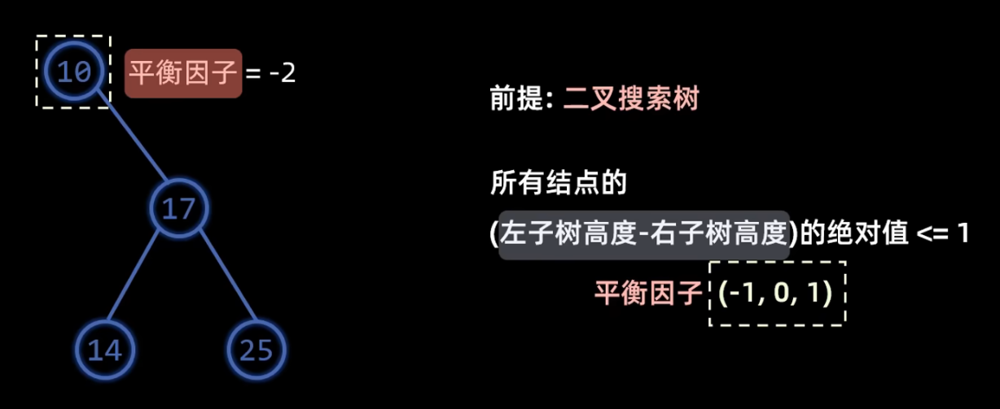

上面这种情况就是 **失衡** 的状态。

---

### 1.3.2 旋转操作

要让 **失衡** 状态的二叉树 **平衡** 起来，就要对二叉树进行旋转操作。

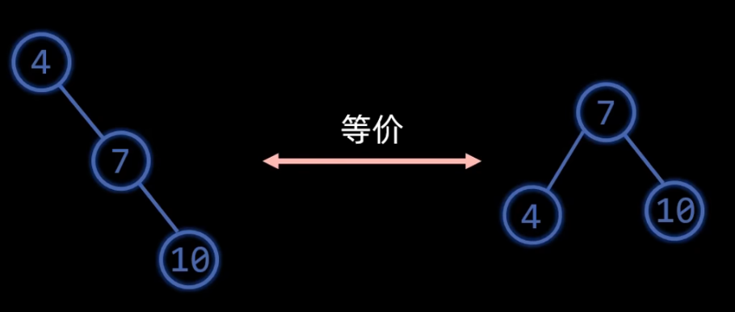

这例子很简单，就是把值为`4`的节点（这个节点的平衡因子为`-2`，失衡了） **左旋** ，作为值为`7`节点的左孩子。

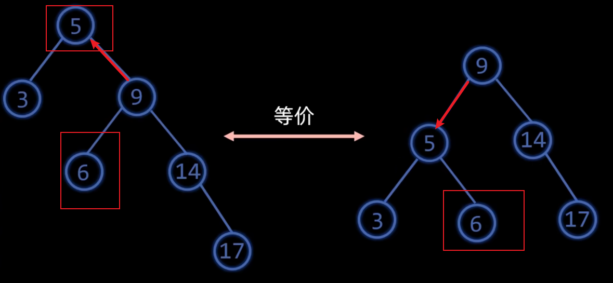

这个就比较复杂了，值为`5`的节点左旋时，会与值为`9`的节点的左子树`6`冲突，所以进行左旋操作时，可以记为： **冲突的左孩子，变成右孩子** 。

下面是 **右旋操作** ，和 **左旋** 类似：
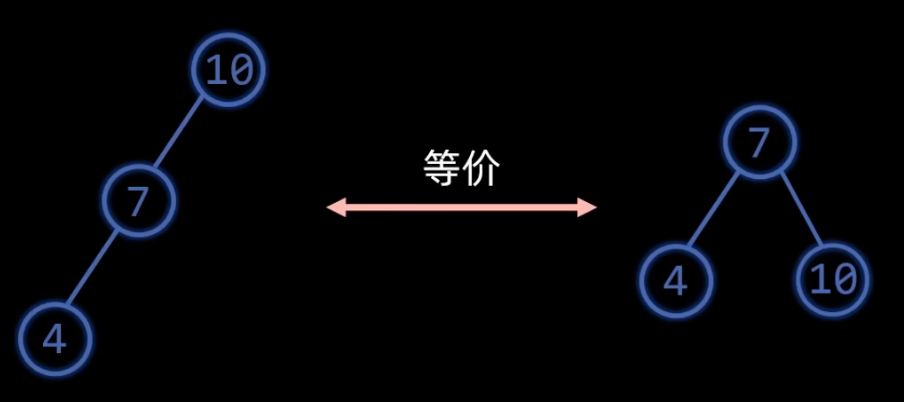


这个可以记为： **冲突的右孩子，变成左孩子** 。

---

### 1.3.3 失衡状态

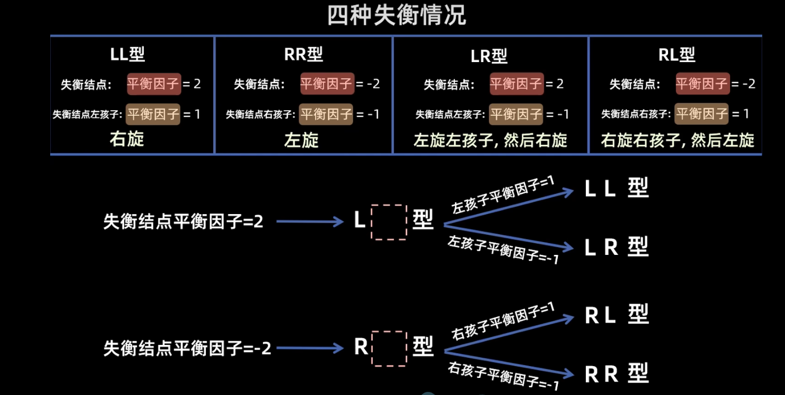

这里只需要记住，**正数** 的平衡因子对应 **L** ， **负数** 的平衡因子对应 **R** 。

---

### 1.3.4 插入节点

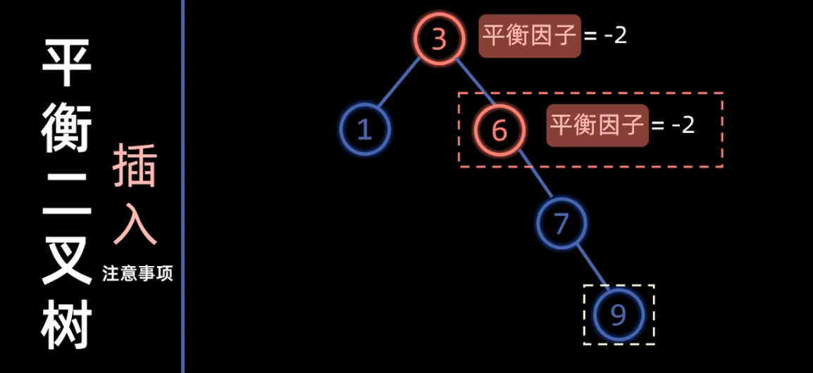

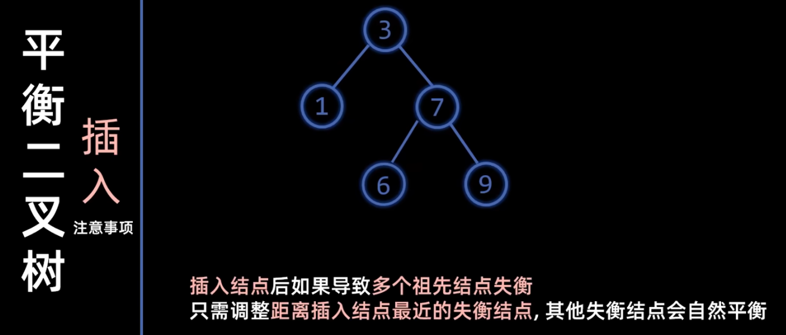

建议把这种结构的平衡二叉树记住，有题目会问“删除节点后，再重新把这个节点添加回去，平衡二叉树的结构会不会改变”这种类似的问题。

----

### 1.3.5 删除节点

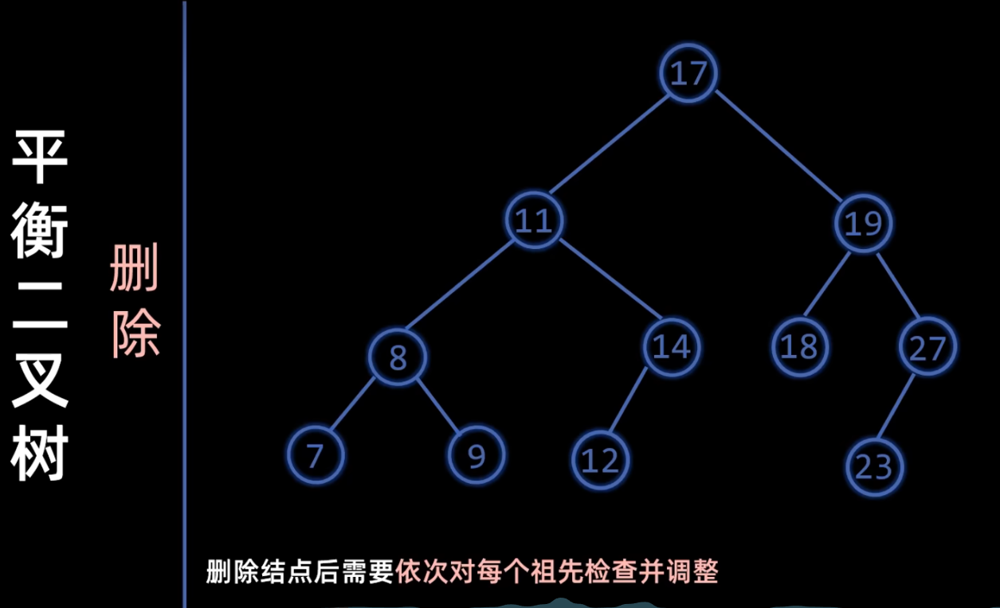

---

## 1.4 红黑树

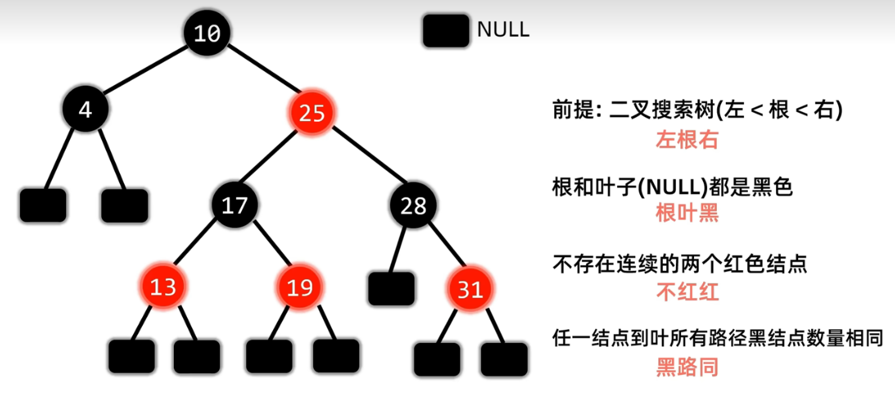

红黑树必须同时满足上面的四个性质！注意：叶节点包括最底下的那些 **空节点** 。

- 红黑树的最长路径不会超过最短路径的两倍。
- 红黑树在进行插入操作时，插入节点默认为 **红色** ，且只可能违反 **根叶黑** 或者 **不红红** 。

---

## 1.5 B 树和 B+ 树

**访问** B-tree 节点的操作是在 **硬盘** 上进行的，节点内的 **查找** 是在 **内存** 中进行的。

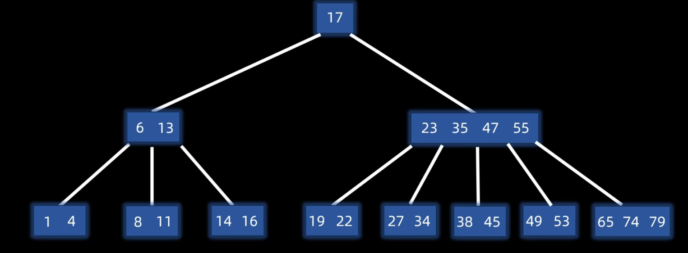

说明：上图是一个 **五阶** B-tree。比如`27 34`这种节点，表示的含义是在它的父节点`23 35 47 55`中`23-35`这个范围内的数，可以从图中显而易见得发现，`27 35`这个节点的“枝”在`23 35`的中间。

1. B 树定义：
   - 平衡：所有叶子节点在同一层，左边和右边分布均匀。
   - 有序：每个 **节点中元素有序**，且左子树小于根，根小于右子树（和二叉搜索树的性质相似）。
   - 多路：对于 \(m\) 阶 B-tree， **最多** \(m\) 个分支，\(m-1\)个元素。对于 **根节点** ，**最少** 有`2`个分支，`1`个元素；对于 **其它节点** ，**最少** 有 \([m/2]\) （向上取整）个分支，\([m/2]-1\) 个元素。

关于 **多路** 部分，我们看`23 35 47 55`这颗子树，它有`5`个分支，节点内有`4`个元素，仔细看下图都就能看出原因。再看`6 13`这个节点，正好对应最少 \([5/2]=3\) 个分支。

2. 插入操作：先查找到插入的位置（一定是从叶子节点开始）进行插入，如果没有上溢出，无需调整，否则中间元素（\([m/2]\)）上移，两边分裂，直到没有上溢出为止。如下图所示，以 3 阶 B-tree 为例（不能改变原树的阶树）：
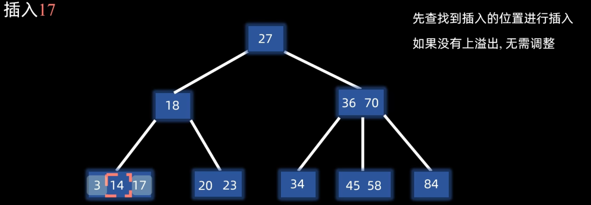

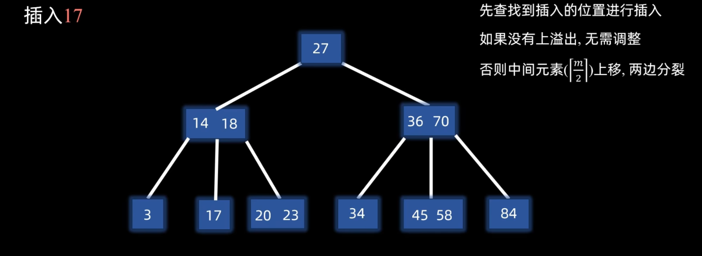

---

## 1.6 散列表（哈希表）

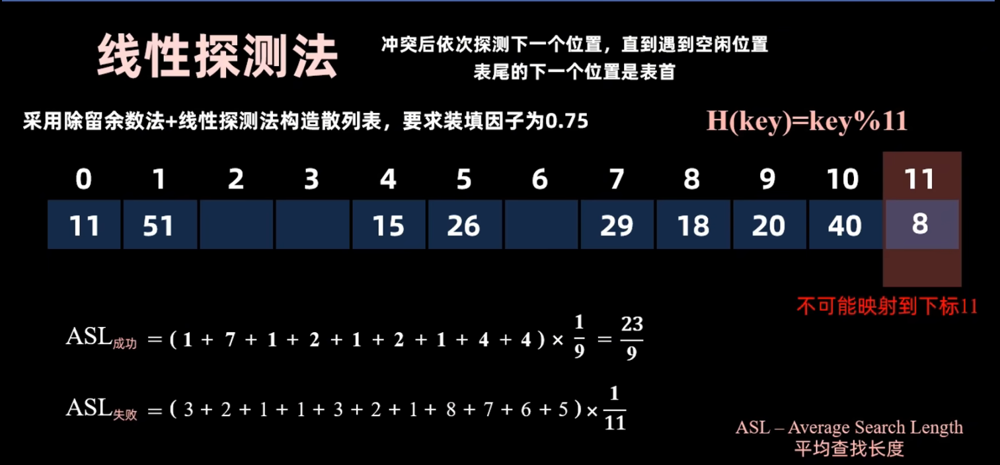

注意：在上图中，求解 \(ASL\) 失败时，空位置也算一次比较，同时不可能映射到`11`。如下（下标是比较次数，比较到空位置才停止）：
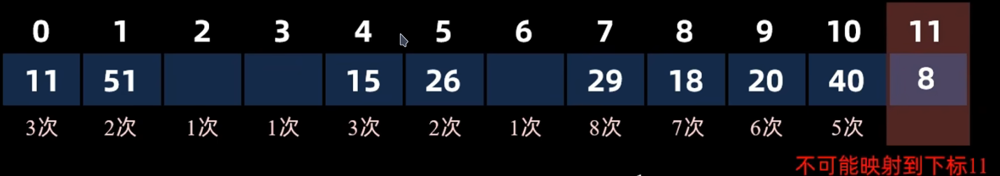

---

## 1.7 KMP 算法

两个概念：
1. 公共前后缀
   - **前缀：** 不包含最后一个字符的所有以第一个字符开头的连续子串
   - **后缀：** 不包含第一个字符的所有以最后一个字符结尾的连续字串
2. `next`数组值：用来记录下一次需要比较的字串序号，当前模式串在该位置匹配冲突时，应该将模式串的哪一位与此位对其。

比如：`ATAATA`：

```bash
找前缀：ATAAT|A

ATAAT
ATAA
ATA     <--
AT
A
```
```bash
找后缀：A|TAATA

TAATA
 AATA
  ATA  <---
   TA
    A
```

然后取它们长度的最大值，称之为 **最长相等前后缀长度** ，比如`ATAATA`的就是`3`。

示例：有主串`aabaabaaf`，模式串`aabaaf`：
```bash
索引：         0 1 2 3 4 5 6 7 8
              a a b a a b a a f
              a a b a a f
模式串的前缀表： 0 1 0 1 2 0
```
从上面可以看出，在第`f`（索引为`5`）时，不匹配了，就找前面 **最长** 的`最长相等前后缀`，也就是为`2`（对应索引`4`），这个`2`就表示的是 **模式串** 中接下来要与主串的`b`（索引`5`处）进行比对的索引。为什么呢？因为`2`表示的是`相等的前后缀长度`，对应在索引里就会减一嘛，索引从`0`开始的。

---

# 2. 补充

---

1. 判断二叉树是否可能构成 **折半查找判定树：** 看树的整体和局部，例如：若整体是左多右少，则任何子树必须左多右少，若某一子树左多右少，则整体必须左多右少。

---

2. 若在高度为`h`的 AVL 树中，所有非叶节点的平衡因子均为`1`，那么该平衡二叉树的总节点数为：
\[
C_h = C_{h-1} + C_{h-2} + 1
\]

---

3. 