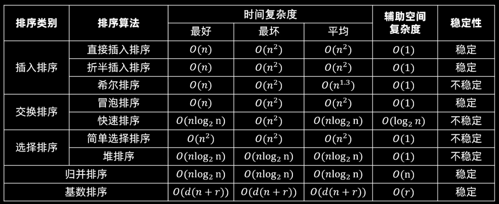

# 1.基本概念

各种排序方式对比：



---

# 2.排序算法代码实现

---

## 2.1 插入类排序

---

### 2.1.1 直接插入排序

```C++
void insert_sort_directly(vector<int> &nums){
    for(int i = 1; i < nums.size(); i++){
        int tmp = nums[i];
        // i 前面的元素都是排好序的，从 i 前面的元素开始
        int j = i - 1;
        // 移动比 tmp 大的元素
        while(j >= 0 && nums[j] > tmp){
            nums[j + 1] = nums[j];
            j--;
        }
        nums[j + 1] = tmp;
    }
}
```

---

### 2.1.2 折半插入排序

```C++
void insert_sort_binary(vector<int> &nums){
    for(int i = 1; i< nums.size(); i++){
         // 如果 nums[i] >= nums[i-1] ，直接去下一个数，因为前面的数都是有序的
        if(nums[i] >= nums[i - 1]){
            continue;
        }

        int tmp = nums[i];
        int right = i - 1;
        int left = 0;
        while(left <= right){
            int mid = left + (right - left) / 2;
            if(nums[mid] <= tmp){
                left = mid + 1;
            }else{
                right = mid - 1;
            }
        }

        int j = i;
        // 把从 left 开始的元素都往后移动，给 tmp 腾出空间
        while(j > left){
            nums[j] = nums[j - 1];
            j--;
        }

        // 插入 tmp，tmp 一定是插到 left 处
        nums[left] = tmp;
    }
}
```

---

### 2.1.3 希尔排序

```C++
void shell_sort(vector<int> &nums){
    // 定义增量
    int increment = nums.size() / 2;
    while(increment > 0){
        for(int k = 0; k < increment; k++){
            for(int i = k + increment; i < nums.size(); i+= increment){
                int tmp = nums[i];
                int j = i - increment;
                while(j >= 0 && nums[j] > tmp){
                    nums[j + increment] = nums[j];
                    j -= increment;
                }

                nums[j + increment] = tmp;
            }
        }

        increment /= 2;
    }
}
```

---

## 2.2 交换类排序

---

### 2.2.1 冒泡排序

```C++
void bubble_sort(vector<int> &nums){
    for(int i = 0; i < nums.size() - 1; i++){
        bool swapped = false;
        for(int j = 0; j < nums.size() - i - i; j++){
            if(nums[j] > nums[j + 1]){
                swap(nums[j], nums[j + 1]);
                swapped = true;
            }
        }

        if(!swapped){
            break;
        }
    }
}
```

---

### 2.2.2 快速排序

```C++
int get_pivot_index(vector<int> &nums, int left, int right){
    int i = left, j = right;    // 初始化左右指针
    // 把左边第一个数作为哨兵
    while(i < j){
        while(i < j && nums[j] >= nums[left]){
            j--;
        }
        while(i < j && nums[i] <= nums[left]){
            i++;
        }

        swap(nums[i], nums[j]);
    }

    swap(nums[left], nums[i]);

    return i;
}

void quick_sort(vector<int> &nums, int left, int right){
    if(left > right){
        return;
    }

    int pivot_index = get_pivot_index(nums, left, right);
    
    quick_sort(nums, left, pivot_index - 1);
    quick_sort(nums, pivot_index + 1, right);
}
```

---

## 2.3 选择类排序

---

### 2.3.1 简单选择排序

```C++
void simply_select_sort(vector<int> &nums){
    for(int i = 0; i < nums.size(); i++){
        int min_index = i;
        for(int j = i + 1; j < nums.size(); j++){
            if(nums[j] < nums[min_index]){
                min_index = j;
            }
        }

        swap(nums[min_index], nums[i]);
    }
}
```

---

### 2.3.2 堆排序

```C++
void sift_down(vector<int> &nums, int i, int end){
    while(true){
        int left_index = 2 * i + 1;
        int right_index = 2 * i + 2;
        int max_index = i;

        if(left_index < end && nums[left_index] > nums[max_index]){
            max_index = left_index;
        }
        if(right_index < end && nums[right_index] > nums[max_index]){
            max_index = right_index;
        }
        if(max_index == i){
            break;
        }

        swap(nums[max_index], nums[i]);
        i = max_index;
    }
}

void heap_sort(vector<int> &nums){
    for(int i = (nums.size() -  1 - 1) / 2; i >= 0; i--){
        sift_down(nums, i, nums.size());
    }

    for(int j = nums.size() - 1; j > 0; j--){
        swap(nums[j], nums[0]);
        sift_down(nums, 0, j);
    }
}
```

---

## 2.4 归并排序

```C++
void merge(vector<int> &nums, int left, int mid, int right){
    vector<int> tmp(right - left + 1, 0);

    int i = left, j = mid + 1, k = 0;

    while(i <= mid && j <= right){
        if(nums[i] <= nums[j]){
            tmp[k++] = nums[i++];
        }else{
            tmp[k++] = nums[j++];
        }
    }

    // 复制剩余的左半部分
    while(i <= mid){
        tmp[k++] = nums[i++];
    }
    // 复制剩余的右半部分
    while(j <= right){
        tmp[k++] = nums[j++];
    }

    // 将临时数组拷回原数组
    for(int i = 0; i < tmp.size(); i++){
        nums[left + i] = tmp[i];
    }
}

void merge_sort(vector<int> &nums, int left, int right){
    if(left >= right){
        return;
    }

    int mid = left + (right - left) / 2;
    merge_sort(nums, left, mid);
    merge_sort(nums, mid + 1, right);

    merge(nums, left, mid, right);
}
```

---

## 2.5 基数排序


---

## 2.6 外部排序

外部排序通常采用归并排序，分为两个阶段：
1. 将整个初始文件分为多个初始归并段；
2. 将初始归并段进行归并，直至得到一个有序的完整文件。